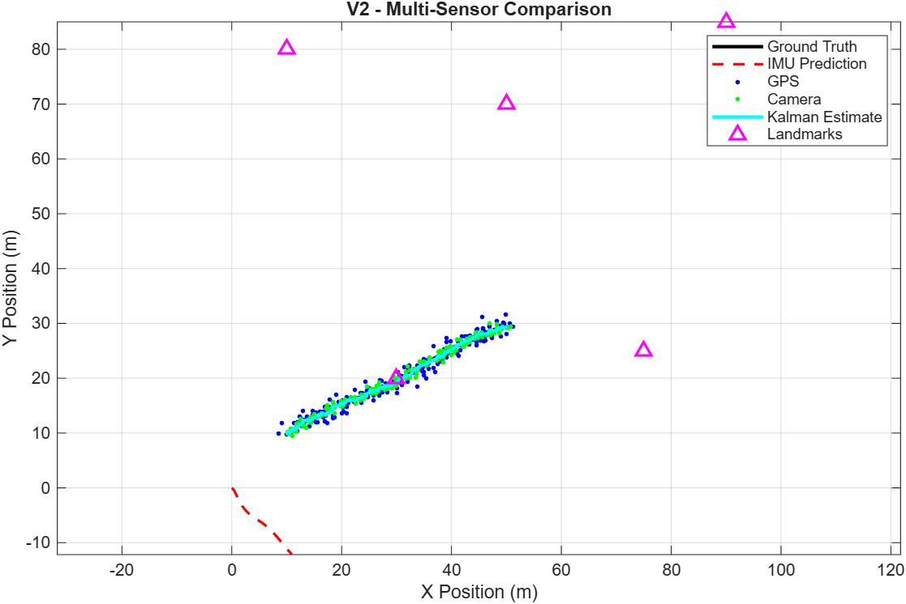
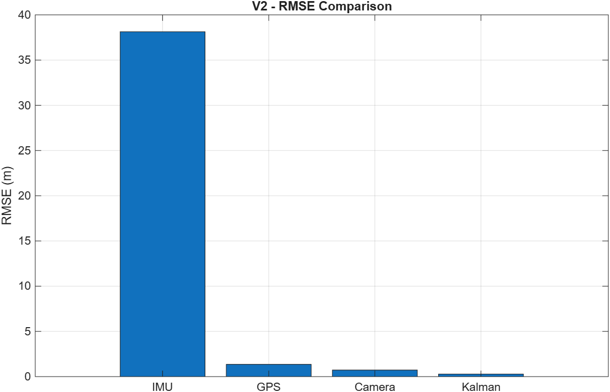

# 2D Çoklu Sensör Füzyonu (Kalman Filtresi) — V2

IMU, GPS ve Kamera sensörlerinden gelen sentetik verilerin Kalman Filtresi ile birleştirildiği (sensor fusion) 2D robot lokalizasyon simülasyonu. MATLAB ile geliştirilmiştir.

## Motivasyon

Tek başına her sensörün bir zayıflığı var:
- **IMU** zamanla drift yapar (ivmenin çift entegrasyonu → hata kareli şekilde büyür)
- **GPS** doğru ama gürültülü ve düşük frekanslı
- **Kamera** landmark'lar görünür olduğu sürece iyi konum bilgisi verir ama görüş alanına bağımlıdır

Bu projenin amacı bu sensörleri Kalman Filtresi ile birleştirip, füzyonun tek tek sensörlere göre ne kadar iyileştirme sağladığını görmek. Uzun vadeli hedef, kamera ölçümlerinin sentetik landmark koordinatlarından değil gerçek görüntü feature extraction'ından gelmesini sağlamak (V3).

## Versiyonlar

### V1 — GPS + IMU Füzyonu
- Tamamen sentetik 2D ground-truth yörünge
- Sentetik IMU (ivme) ve GPS (konum) ölçümleri, ikisine de gürültü eklendi
- Kalman Filtresi, IMU tahminini (prediction) GPS ile düzeltiyor (correction)
- Temel füzyon döngüsünü gösteriyor: predict (IMU) → correct (GPS)

### V2 — GPS + IMU + Kamera Füzyonu
V1'e üçüncü bir sensör ve sentetik bir ortam eklendi:
- **Sentetik 2D ortam**: sabit landmark konumları (`createEnvironment.m`)
- **Sentetik kamera sensörü**: menzil içindeki en yakın landmark'a bakarak konum ölçümü üretiyor (`simulateCamera2D.m`)
- **Kalman Filtresi** artık üç sensörü de füzyonluyor (IMU prediction + GPS/Kamera correction)
- Her sensörü ground truth ile karşılaştıran **RMSE analizi** eklendi

#### V2 Sonuçları

| Sensör | RMSE (m) |
|--------|----------|
| IMU    | 38.1284  |
| GPS    | 1.3569   |
| Kamera | 0.7260   |
| **Kalman (füzyon)** | **0.2802** |

Füzyonlanmış Kalman tahmini tüm tekil sensörlerden daha düşük hataya sahip. IMU'nun yüksek RMSE değeri beklenen ve kasıtlı bir sonuç — bias düzeltmesi yapılmadan gürültülü ivmenin çift entegrasyonuyla oluşan klasik dead-reckoning drift'ini gösteriyor. GPS/Kamera düzeltmesinin çözmesi gereken problem tam olarak bu.




## Sistem Mimarisi (V2)

```
                      GERÇEK HAREKET (GROUND TRUTH)
                                │
                                ▼
                      ┌───────────────────┐
                      │   Motion Model     │
                      │ a_true, v_true,    │
                      │ x_true             │
                      └─────────┬──────────┘
                                │
              ┌─────────────────┼─────────────────┐
              │                 │                 │
              ▼                 ▼                 ▼
      ┌──────────────┐  ┌──────────────┐  ┌──────────────────┐
      │  IMU Model   │  │  GPS Model   │  │  Environment +    │
      │              │  │              │  │  Camera Model     │
      │ Noise + Bias │  │  GPS Noise   │  │ Landmarks + Range │
      └──────┬───────┘  └──────┬───────┘  └─────────┬─────────┘
             │                 │                    │
             ▼                 ▼                    ▼
      ┌──────────────┐    GPS Position      Kamera Position
      │ Integration  │   (Ölçüm 1)          (Ölçüm 2, landmark
      │  a → v → x   │                       görünürse)
      └──────┬───────┘
             │
             ▼
      IMU Position Prediction
             │
             │
             └──────────────────┐
                                 ▼
                       ┌──────────────────┐
                       │  Kalman Filter   │
                       │                  │
                       │ IMU Prediction   │
                       │        +         │
                       │ GPS Correction   │
                       │        +         │
                       │ Kamera Correction│
                       └────────┬─────────┘
                                │
                                ▼
                       Kalman State Estimate
                         Position + Velocity
```

V1'den farkı: IMU tahmin adımından sonra düzeltme (correction) tek kaynaktan (GPS) değil, mevcutsa hem GPS hem de kamera ölçümünden geliyor — kamera düzeltmesi yalnızca en az bir landmark görüş menzili içindeyken devreye giriyor (`simulateCamera2D.m` içindeki `visible` kontrolü).

## Bilinen Sınırlamalar / Notlar

- **Landmark ve ivme verileri sentetik**: Bu, füzyon sonucunu olduğundan daha iyi gösteriyor olabilir. Gerçek veriyle bu farkın kapanması V3'ün hedeflerinden biri.
- **Kamera ölçümü şu an aslında dolaylı yoldan gerçek konumu okuyor**: `simulateCamera2D.m` içinde
  ```matlab
  relativeX = landmarkX - trueX;
  measuredX = landmarkX - relativeX;   % cebirsel olarak measuredX = trueX
  ```
  satırı sadeleştirildiğinde `measuredX = trueX` anlamına geliyor. Yani landmark'lar şu an sadece "görünür mü değil mi" (menzil) kontrolü için kullanılıyor; ölçümün kendisi landmark geometrisinden (bearing/range) türetilmiyor, doğrudan gerçek konum + gürültü olarak üretiliyor. V2 için makul bir basitleştirme, ama V3'te gerçek feature extraction'a geçildiğinde ölçüm, landmark'a göre **göreli açı/mesafeden** (bearing-range) hesaplanacak şekilde değişecek.

## Yol Haritası

- [x] **V1** — Sentetik IMU + GPS füzyonu
- [x] **V2** — Sentetik kamera/landmark sensörü + RMSE analizi
- [ ] **V3** — Sentetik kamera ölçümünü, görüntülerden gerçek feature extraction (bearing-range tabanlı landmark tespiti) ile değiştirme
- [ ] **V4 (planlanan)** — Daha gerçekçi sensör gürültü modelleri, IMU bias tahmini, muhtemelen 3D genişletme

## Repo Yapısı

```
├── filters/
│   └── kalmanFilter2D.m         % çoklu sensör Kalman Filtresi
├── simulation/
│   ├── createEnvironment.m      % sentetik 2D ortam + landmark'ları oluşturur
│   ├── generateMotion2D.m       % ground-truth yörünge üretir
│   ├── integrateIMU2D.m         % IMU dead-reckoning entegrasyonu
│   ├── simulateIMU2D.m          % sentetik gürültülü IMU ölçümleri
│   ├── simulateGPS2D.m          % sentetik gürültülü GPS ölçümleri
│   └── simulateCamera2D.m       % landmark'lardan sentetik kamera ölçümleri
├── figures/                     % kaydedilen sonuç grafikleri
├── main.m
└── README.md
```

## Nasıl Çalıştırılır

```matlab
% MATLAB'de repo kök dizininden:
main   % V2 simülasyonunu çalıştırır, RMSE sonuçlarını yazdırır, grafikleri çizer
```

Ek toolbox gerekmiyor, temel MATLAB yeterli.

## Kullanılan Teknikler

- MATLAB
- Kalman Filtresi (doğrusal, IMU tahmin tabanlı prediction modeli)
- Sentetik sensör + ortam simülasyonu