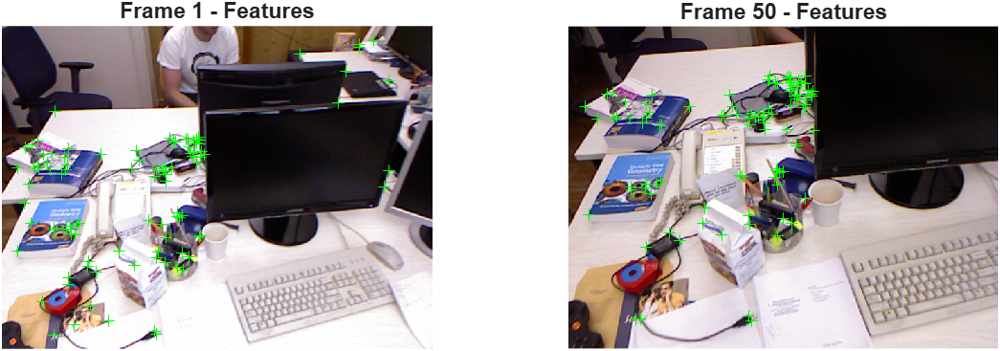
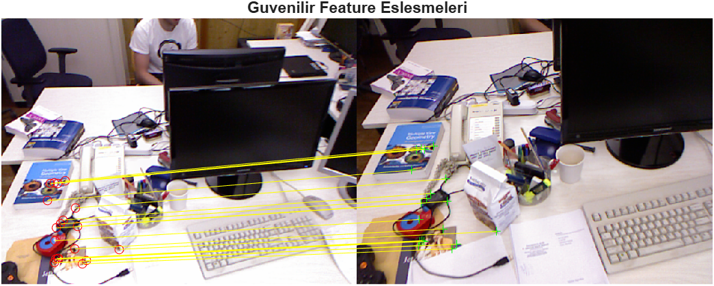
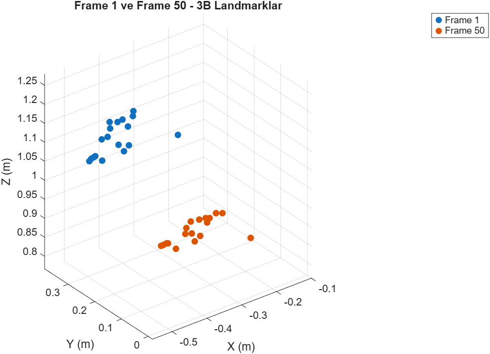

# RGB-D Feature Extraction & 3B Landmark Hareket Tahmini — V3.1

Gerçek bir RGB-D veri seti (kamera parametrelerine bakılırsa TUM RGB-D formatına uygun; farklıysa güncelle) kullanılarak, görüntüden feature çıkarma, eşleştirme ve depth bilgisiyle 3B landmark konumu hesaplama sürecinin adım adım incelendiği çalışma. V2'deki tamamen sentetik landmark yaklaşımından farklı olarak burada landmark'lar gerçek görüntülerden **feature detection + depth back-projection** ile elde ediliyor.

## Amaç

V3'ün genel hedefi, V2'de sentetik olarak okunan kamera ölçümlerini gerçek görüntü işleme pipeline'ı ile değiştirmek. V3.1 bunun ilk adımı — henüz tam bir görsel odometri/SLAM sistemi değil, amaç şunu öğrenmek ve doğrulamak:

- Gerçek bir görüntüde feature'lar (köşe noktaları) nasıl tespit edilir (Harris corner detection)
- İki farklı frame arasında bu feature'lar nasıl eşleştirilir (feature matching)
- Yanlış eşleşmeler (outlier) geometrik tutarlılık kontrolüyle nasıl ayıklanır
- Depth görüntüsü kullanılarak 2B piksel koordinatları gerçek 3B dünya koordinatına nasıl çevrilir (back-projection)
- İki frame arasındaki 3B landmark kümesinden kameranın rotasyon + translasyonu (rijit dönüşüm) nasıl tahmin edilir

Bu adım, V3.2'de tam bir IMU + kamera füzyon pipeline'ına geçmeden önce görüntü işleme tarafının tek başına doğru çalıştığını doğrulamak için atıldı.

## Sistem Mimarisi

```
RGB Görüntü Dizisi (data/rgb)         Depth Görüntü Dizisi (data/depth)
        │                                       │
        ▼                                       │
┌─────────────────────┐                         │
│  Frame 1 & Frame 50  │                         │
│     seçimi           │                         │
└──────────┬───────────┘                         │
           │                                     │
           ▼                                     │
┌─────────────────────┐                          │
│  Feature Detection   │                          │
│  (Harris Corners)    │                          │
└──────────┬───────────┘                          │
           │                                      │
           ▼                                      │
┌─────────────────────┐                           │
│  Feature Matching    │                           │
│ (Frame1 ↔ Frame50)   │                           │
└──────────┬───────────┘                           │
           │                                       │
           ▼                                       │
┌─────────────────────────────┐                    │
│ Geometrik Tutarlılık Filtresi│                    │
│ (estimateGeometricTransform2D)│                   │
│   → outlier eşleşmeleri ele  │                    │
└──────────┬────────────────────┘                   │
           │                                        │
           ▼                                        │
┌─────────────────────┐                             │
│ Güvenilir (inlier)   │                             │
│ 2B eşleşen noktalar  │                             │
└──────────┬───────────┘                             │
           │                                         │
           ▼                                         ▼
┌───────────────────────────────────────────────────────┐
│         Depth Back-Projection (u,v,depth → X,Y,Z)      │
│              Kamera içsel parametreleri (fx,fy,cx,cy)  │
└──────────────────────────┬──────────────────────────────┘
                            │
                            ▼
                 3B Landmark Kümesi
                 (Frame 1 & Frame 50)
                            │
                            ▼
              ┌──────────────────────────┐
              │  Rijit Dönüşüm Tahmini    │
              │  (SVD / Kabsch Algoritması)│
              │   → Rotasyon R, Öteleme t │
              └──────────────┬─────────────┘
                              │
                              ▼
                  Kamera Hareketi Tahmini
                   (R, t) + 3B RMSE Hatası
```

## Sonuçlar

**Feature Detection & Matching**

| Metrik | Değer |
|---|---|
| Toplam görüntü sayısı | 798 |
| Frame 1 feature sayısı | 565 |
| Frame 50 feature sayısı | 560 |
| Eşleşen feature sayısı | 50 |
| Güvenilir (inlier) eşleşme sayısı | 22 |
| Ortalama piksel hareketi (ham eşleşme) | dx = 29.03, dy = -55.87 px |
| Ortalama piksel hareketi (inlier) | dx = 22.23, dy = -50.98 px |

**3B Landmark & Rijit Dönüşüm Tahmini**

| Metrik | Değer |
|---|---|
| Geçerli (depth > 0) 3B landmark sayısı | 21 / 22 |
| Ortalama 3B hata | 0.0087 m |
| 3B RMSE | 0.0103 m |

Tahmin edilen rotasyon matrisi R ve öteleme vektörü t, 21 geçerli landmark üzerinden SVD (Kabsch algoritması) ile hesaplandı; hesaplanan dönüşüm gerçek Frame 50 landmark konumlarını ~1 cm hata payıyla yeniden üretiyor — bu da feature eşleştirme + depth back-projection zincirinin tutarlı çalıştığını gösteriyor.





## Bilinen Sınırlamalar / Notlar

- **50 eşleşen feature'dan sadece 22'si güvenilir (inlier) çıktı** (%44). Bu oran Harris corner + brute-force matching kombinasyonu için beklenen bir seviye; daha güçlü bir feature descriptor (ör. ORB, SIFT) veya daha sıkı eşleştirme eşiği ile artırılabilir.
- **Depth = 0 sorunu**: 22 inlier landmark'tan biri (Landmark 8) Frame 1'de geçersiz depth okuması (`Z1 = 0.000 m`) verdi — muhtemelen depth sensörünün o pikselde veri üretemediği bir nokta (yansıma, menzil dışı, vb.). Kod bunu `validDepth` filtresiyle otomatik eledi (22 → 21 landmark). Gerçek RGB-D verisiyle çalışırken karşılaşılan tipik bir problem; V3.2'de bu tür eksik/gürültülü depth noktalarının nasıl ele alınacağı (interpolasyon, komşu piksel ortalaması vb.) ayrı bir konu.
- **Sadece iki frame (1 ve 50) karşılaştırıldı** — bu bir "tekil adım" doğrulaması, henüz zaman içinde sürekli bir takip (tracking) yok. V3.2'nin hedeflerinden biri bunu ardışık frame'ler üzerinden sürekli hale getirmek.
- **Kamera hareketi varsayımı**: rijit dönüşüm tahmini, sahnenin statik olduğunu ve landmark'ların gerçekten aynı fiziksel noktayı temsil ettiğini varsayıyor; hareketli nesneler sahnede varsa (bu veri setinde masa üstü nesneler dursa da insan hareket edebilir) bu landmark'lar dönüşüm tahminini bozabilir.


## Repo Yapısı

```
├── vision/
│   └── detectFeatures.m       % Harris corner detection + feature extraction
├── data/
│   ├── rgb/                   % RGB görüntü dizisi (.png)
│   └── depth/                 % Depth görüntü dizisi (.png)
├── figures/                   % kaydedilen sonuç grafikleri
├── main.m
└── README.md
```

## Nasıl Çalıştırılır

```matlab
% MATLAB'de repo kök dizininden:
main   % Frame 1 & 50 feature detection, matching, 3B landmark ve
       % rijit dönüşüm tahminini çalıştırır, sonuçları yazdırır ve grafikleri çizer
```

Gerekli: `data/rgb` ve `data/depth` klasörlerinde eşleşen isimli RGB ve depth görüntüleri. Computer Vision Toolbox gerekiyor (`detectHarrisFeatures`, `extractFeatures`, `matchFeatures`, `estimateGeometricTransform2D`, `showMatchedFeatures`).

## Kullanılan Teknikler

- MATLAB, Computer Vision Toolbox
- Harris Corner Detection
- Feature matching (brute-force) + RANSAC tabanlı geometrik tutarlılık filtresi
- Depth back-projection (pinhole kamera modeli)
- SVD / Kabsch algoritması ile rijit dönüşüm (rotasyon + öteleme) tahmini